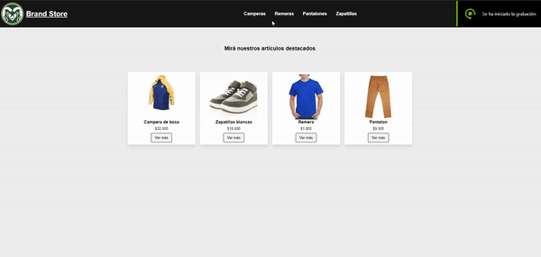

# Brand Store

Brand Store es un template para un e-commerce utilizando React

Este proyecto fue seteado con [Create React App](https://create-react-app.dev/)

## Funciones incluidos en la Primer Entrega

- Configuración del Routing usando [React Router](https://reactrouter.com/en/main):

    › Rutas del Navbar para navegar entre las categorias

    › Rutas del Home y Cart

    › Ruta para ver el detalle de cada producto clickeando en "Ver más"

## Dependencias utilizadas
- React Router
- SASS
- MUI - Icons Materials
- Toastify
- Sweet Alert

## License
[Fran Ortega](https://www.linkedin.com/in/franco-ortega-fo/)